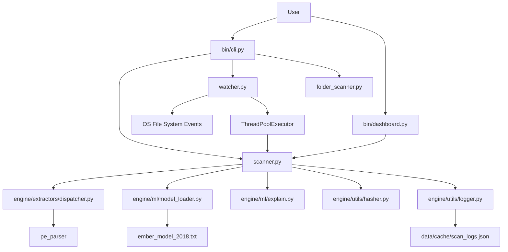
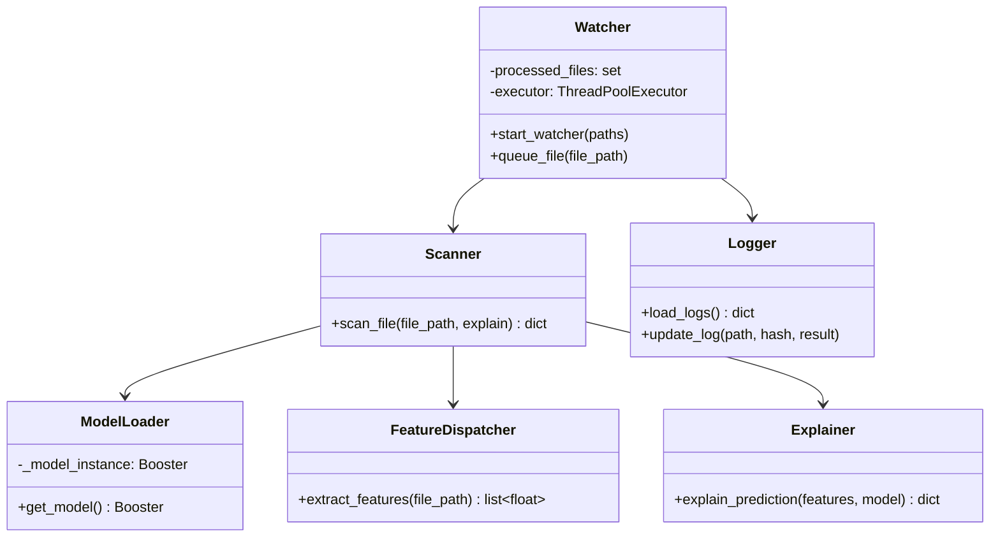
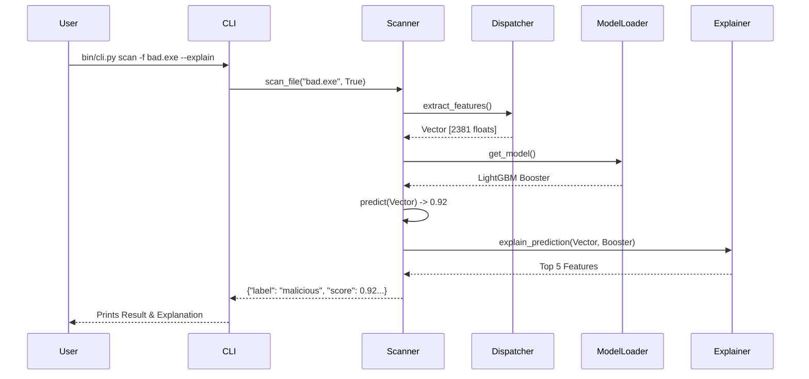

# Aegis Sentinel (Enterprise ML Malware Scanner) - Technical Documentation

## 1. Executive Summary

* **Project Name**: Aegis Sentinel (Enterprise ML Malware Scanner)
* **Project Purpose**: To provide a next-generation malware scanning engine that leverages machine learning for static analysis and real-time threat detection.
* **Problem Statement**: Traditional signature-based antivirus solutions are ineffective against zero-day threats and polymorphic malware. This project solves this by using ML to detect malicious intent based on file heuristics and metadata.
* **Business Use Case**: Protecting enterprise endpoints from ransomware, trojans, and zero-day attacks without relying on internet-connected signature updates.
* **Target Users**: Enterprise security teams, SOC analysts, and system administrators.
* **Key Functionalities**: Single file scanning (CLI/UI), bulk folder scanning, background real-time protection (watchdog), AI decision explainability (LightGBM native SHAP), and caching for performance.
* **Technology Stack**: Python, LightGBM (EMBER 2018 model), Streamlit, Watchdog.
* **High-Level Architecture Summary**: A modular architecture consisting of a Presentation Layer (Streamlit UI, Argparse CLI), a Business Logic Layer (Real-time Watchdog, Batch Scanner), and an AI/Feature Extraction Layer (LightGBM, PE/ZIP parsers) backed by a local JSON cache.
---

## 2. Problem Statement

* **What problem this project solves**: The inability of traditional antivirus to detect novel (zero-day) malware.
* **Why the problem exists**: Attackers constantly re-pack and obfuscate malware, changing its file hash and signature, rendering signature databases obsolete.
* **Real-world use cases**: A user downloads a seemingly benign PDF or executable from a phishing email. The real-time watcher intercepts the file, scans its 2,351 static features, and blocks it before execution.
* **Business value**: Reduces the risk of data breaches, ransomware downtime, and intellectual property theft.
* **Challenges addressed**: The need for fast, offline, and explainable AI inferences on endpoints without consuming massive CPU/RAM resources.

---

## 3. Functional Requirements

1. **Feature Name**: Single File AI Scan
   * **Description**: Scan a specific file and get a confidence score.
   * **User Interaction**: CLI (`bin/cli.py scan -f file.exe`) or Streamlit UI.
   * **Backend Processing**: Feature extraction -> LightGBM predict.
   * **Data Involved**: Target executable, ML model.

2. **Feature Name**: AI Explainability
   * **Description**: Explain why the AI flagged a file using human-readable interpretations.
   * **User Interaction**: Add `--explain` flag or check UI box.
   * **Backend Processing**: LightGBM native `pred_contrib` calculates feature impacts, which are then translated into plain English (e.g., `🔴 Suspicious` or `🟢 Legitimate`).
   * **Data Involved**: Extracted feature vector, native SHAP values, formatted UI strings.

3. **Feature Name**: Real-Time Background Protection
   * **Description**: Monitor configured directories for new files.
   * **User Interaction**: Run `bin/cli.py protect`.
   * **Backend Processing**: Watchdog events -> Hash -> Cache Check -> Background Thread Scan.
   * **Data Involved**: File system events, SHA-256 hashes, JSON logs.

4. **Feature Name**: Bulk Folder Scanning
   * **Description**: Recursively scan a directory.
   * **User Interaction**: CLI (`bin/cli.py scan -d /path/`).
   * **Backend Processing**: Directory walk -> ThreadPoolExecutor -> Batch prediction.
   * **Data Involved**: Multiple files, parallel I/O.

5. **Feature Name**: Configuration Management
   * **Description**: Manage settings like watch paths.
   * **User Interaction**: CLI (`bin/cli.py config --add-path ...`).
   * **Backend Processing**: Read/Write `settings.json`.
   * **Data Involved**: JSON configuration object.

6. **Feature Name**: Desktop Agent Download
   * **Description**: Allows users to download the compiled standalone background agent globally without taxing cloud memory limits.
   * **User Interaction**: Click the download button in the Streamlit sidebar.
   * **Backend Processing**: Uses an HTML anchor tag to redirect the download directly from GitHub Releases. If running locally, it detects the `dist` folder and provides the absolute path.
   * **Data Involved**: External GitHub Release URL (`AegisSentinel_Agent.zip`).

---

## 4. Non Functional Requirements

* **Scalability**: Handled via `concurrent.futures.ThreadPoolExecutor` in both `watcher.py` and `folder_scanner.py`. The system scales worker threads dynamically based on CPU cores.
* **Reliability**: Errors during feature extraction or scanning of corrupted files are caught and logged without crashing the background daemon.
* **Security**: The system operates 100% locally. No files or hashes are sent over the internet, preserving enterprise privacy.
* **Maintainability**: The `engine/extractors/dispatcher.py` uses a Factory/Strategy pattern to decouple feature extraction logic by file type.
* **Performance**: The 127MB LightGBM model is loaded via a Singleton pattern (`engine/ml/model_loader.py`). File caching via SHA-256 (`engine/utils/hasher.py`) prevents re-scanning unmodified files. Hashes are computed in 4MB chunks to prevent memory bloat on large files.
* **Availability**: Designed to run as a continuous background daemon (`protect` mode) that gracefully handles keyboard interrupts.

---

## 5. Complete Project Structure

```
Aegis-Sentinel/
├── bin/dashboard.py                      # Presentation: Streamlit Web Dashboard
├── bin/cli.py                     # Presentation: Main CLI Entry Point
├── settings.json               # Configuration: User settings
├── data/models/
│   └── ember_model_2018.txt    # Data: Pre-trained LightGBM Model
├── data/cache/
│   └── scan_logs.json          # Data: Local caching and scan history
├── engine/                    # Business & ML Logic
│   ├── config.py               # Settings manager
│   ├── explain.py              # LightGBM native explainability
│   ├── folder_scanner.py       # Parallel recursive directory scanner
│   ├── hasher.py               # Memory-efficient SHA-256 generator
│   ├── logger.py               # Cache reading/writing
│   ├── model_loader.py         # Singleton LightGBM loader
│   ├── scanner.py              # Core scan workflow (extract -> predict)
│   ├── watcher.py              # Watchdog real-time daemon
│   └── features/               # Feature Extraction Layer
│       ├── dispatcher.py       # Strategy pattern router
│       ├── base.py             # Abstract base class
│       └── pe_features.py      # Extracts features from Windows executables
```

* **Presentation Layer**: Exposes the functionality to users (CLI/Web).
* **Business Logic Layer (`engine/`)**: Orchestrates the scanning, caching, and background monitoring.
* **Feature Extraction Layer (`engine/extractors/`)**: Translates raw bytes into mathematical vectors.
* **Data Access Layer**: Manages the JSON cache and configurations.

---

## 6. Architecture Analysis

* **Architecture Style**: Layered / Modular architecture with elements of Event-Driven design (for the watcher daemon).
* **Why chosen**: Separation of concerns. The ML logic is completely decoupled from the UI and CLI, allowing for multiple interfaces (Streamlit and Argparse).
* **Benefits**: Highly testable, maintainable, and extensible (e.g., adding a new file type only requires adding a new file in `engine/extractors/` and updating the dispatcher).
* **Limitations**: The current event-driven watcher uses ThreadPools which are bound by Python's Global Interpreter Lock (GIL). For heavy CPU-bound feature extraction, this could become a bottleneck.

### Architecture Diagram



---

## 7. Technology Stack Deep Dive

### Python
* **Purpose**: Core application language.
* **Why used**: Unmatched ecosystem for ML, scripting, and system automation.

### LightGBM
* **Purpose**: Gradient Boosting framework used for the core ML model.
* **Why used**: Extremely fast training and inference on tabular data (2,351 EMBER features). Consumes less memory than deep learning counterparts.
* **Alternatives**: XGBoost, Random Forest, Deep Neural Networks.
* **Tradeoffs**: Less capable of analyzing sequential raw bytes (where CNNs/LSTMs shine), but dramatically faster and requires less compute power.

### Native Explainability (pred_contrib)
* **Purpose**: AI Decision Explainability.
* **Why used**: Replaced the heavy, bug-prone Python `shap` library with LightGBM's native C++ `pred_contrib` functionality. It calculates exact SHAP feature contributions locally without JSON serialization or high memory overhead.
* **Tradeoffs**: Negligible compute cost compared to external explainer libraries. Hidden behind an `--explain` flag to keep standard scans absolutely minimal.

### Streamlit
* **Purpose**: Enterprise Web Dashboard.
* **Why used**: Allows rapid deployment of data-heavy web apps purely in Python.
* **Alternatives**: Flask, FastAPI + React.
* **Tradeoffs**: Less customizable than a full React frontend, but saves weeks of development time.

### Watchdog
* **Purpose**: Real-time OS file monitoring.
* **Why used**: Cross-platform library to hook into file creation/modification events instantly.

---

## 8. Database Design

The system uses a lightweight NoSQL approach (JSON File) to avoid the overhead of setting up a relational database for a local endpoint agent.

### Entity: Scan Log (`data/cache/scan_logs.json`)
* **Key**: SHA-256 File Hash (String)
* **Value**: Object containing:
  * `file_path` (String)
  * `label` (String: "malicious" | "safe")
  * `score` (Float)
  * `timestamp` (ISO-8601 String)

### Rationale
Using the file hash as the key enforces a natural uniqueness constraint. If a file is moved or renamed, its hash remains the same, preventing redundant scanning.

---

## 9. Domain Model Analysis



---

## 10. API Documentation (Internal Modules)

### `engine/scanner.py::scan_file`
* **Purpose**: Main entrypoint for file analysis.
* **Arguments**: `file_path` (str), `explain` (bool)
* **Response DTO**:
```json
{
  "label": "malicious",
  "score": 0.9543,
  "explanation": [
    {"feature": "Byte Entropy", "impact": 1.2},
    {"feature": "Imports", "impact": 0.8}
  ]
}
```
* **Business Logic**: Extracts features -> Loads Singleton Model -> Predicts probability -> Thresholds at 0.8336 -> Computes SHAP (if requested).

---

## 11. Feature-by-Feature Deep Dive

### Background Agent (Protect Mode)
* **Purpose**: Prevent malware execution by detecting it the moment it touches the disk.
* **User Flow**: User runs `bin/cli.py protect`. The app loads `settings.json`, does an initial sweep of the folders, and attaches OS hooks.
* **Backend Flow**:
  1. `watchdog` detects file creation.
  2. The `FileHandler` receives the event and debounces it using `time.sleep(1.5)` (allows large downloads to finish).
  3. Hash is computed via `engine/utils/hasher.py`.
  4. Cache is checked via `engine/utils/logger.py`. If cached, execution halts.
  5. The scan is dispatched to a `ThreadPoolExecutor`.
* **Security Considerations**: The sleep timer is a potential race condition vulnerability. Advanced malware could execute within that 1.5-second window before the scan finishes.
* **Tradeoffs**: Polling vs Event-driven. Event-driven consumes almost 0 CPU until an event occurs. ThreadPools allow concurrent scanning of multiple downloaded files.

### AI Decision Explainability
* **Purpose**: SOC analysts need to know *why* a file was blocked.
* **Backend Flow**: LightGBM's `predict(pred_contrib=True)` processes the 2381-feature vector natively in C++. A custom mapper (`get_ember_feature_name`) translates raw indices into human-readable categories (e.g., "Section Properties", "Imports").
* **Why This Implementation**: Security practitioners do not trust black boxes. Generating SHAP feature contributions natively provides mathematical proof of which features tipped the model's decision boundary without requiring external heavy dependencies.

---

## 12. End-to-End Request Lifecycle



---

## 13. Security Analysis

* **Strengths**: 
  * Air-gapped capable (requires no internet connection).
  * Data privacy (no files sent to the cloud).
  * Safe memory handling for large files (`iter(lambda: f.read(...))` in hasher).
* **Missing/Vulnerabilities**:
  * **Evasion via Time-of-Check to Time-of-Use (TOCTOU)**: The 1.5s sleep in the watcher could allow malware to execute before it is scanned and quarantined.
  * **No automatic quarantine**: The agent detects and logs but currently does not quarantine or delete the malicious file automatically.
  * **Model Poisoning / Adversarial ML**: Attackers could append benign data to the PE file to shift the feature distribution and trick the LightGBM model.

---

## 14. Design Patterns

1. **Singleton (`engine/ml/model_loader.py`)**
   * *Location*: `get_model()` uses `global _model_instance`.
   * *Purpose*: The LightGBM model is 127MB. Loading it into memory takes 1-2 seconds. The singleton ensures it is loaded exactly once for the entire lifecycle of the application.
2. **Strategy / Factory (`engine/extractors/dispatcher.py`)**
   * *Location*: `extract_features()`.
   * *Purpose*: Decouples the scanning engine from the specific file format parsing logic.
3. **Facade (`engine/scanner.py`)**
   * *Location*: `scan_file()`.
   * *Purpose*: Hides the complexity of feature extraction, model loading, predicting, thresholding, and SHAP logic behind one simple function call.

---

## 15. Performance Analysis

* **Expensive Operations**:
  1. Parsing large PE (Portable Executable) files.
* **Memory Concerns**: Reading a 5GB ISO file to memory would crash the app. The `engine/utils/hasher.py` mitigates this via 4MB chunking. However, feature extractors must also be written to handle large files efficiently.
* **Optimizations Suggested**: Convert JSON log file to SQLite. If the JSON file grows to 100,000 entries, parsing the entire JSON string into a Python dict on every scan will cause massive I/O lag.

---

## 16. Scalability Analysis

* **10x Traffic (Heavy Local Usage)**: ThreadPoolExecutor handles this well by dynamically sizing to CPU cores (max 8).
* **100x Traffic (Server deployment)**: If deployed as a web service, the Python GIL will bottleneck the feature extraction threads.
* **Mitigation**: Move from `ThreadPoolExecutor` to `ProcessPoolExecutor` or Celery/Redis for distributed, multi-process feature extraction.

---

## 17. Error Handling Strategy

* **Global isolation**: Scans are wrapped in `try/except` blocks (`scan_wrapper` in folder_scanner, and inside `scanner.py`).
* **Silent Failures in Background**: If a file is locked by another process (common in Windows), the watcher logs the error but does not crash. The file is removed from `processed_files` allowing it to be retried later.

---

## 18. Testing Strategy

* **Gap Analysis**: The repository currently lacks automated unit testing (`pytest` framework), mock objects, and CI/CD pipelines.
* **Required Tests**: 
  * Unit tests for each feature extractor to ensure accurate byte entropy calculations.
  * Integration tests simulating file drops to trigger the Watchdog.
  * Performance tests to ensure memory usage doesn't spike.

---

## 19. Configuration Analysis

* **File**: `settings.json` managed via `engine/utils/config.py`.
* **Resilience**: If the JSON is corrupted or deleted, `load_config()` falls back to a hardcoded `DEFAULT_CONFIG` dictionary and recreates the file. This ensures the daemon never fails to start due to missing configs.

---

## 20. Deployment Architecture

The project employs a dual-deployment strategy: a local compiled agent for endpoint protection, and a cloud-hosted web dashboard for SOC analyst access.

### 1. Desktop Agent Build (Local Endpoint Deployment)
The `aegis_sentinel.spec` file indicates PyInstaller is used to package the Python scripts, LightGBM binaries, and the Streamlit UI into a single standalone Windows Executable (`.exe`). The `sys.frozen` check in `model_loader.py` and `logger.py` handles the path routing differences between running from source vs running as a compiled binary.

To build the project into a standalone executable, ensure you are in the project root directory and run:

```cmd
pip install pyinstaller
pyinstaller aegis_sentinel.spec --clean
```

Upon completion, PyInstaller will create a `dist/aegis_sentinel/` directory containing the `.exe` and its bundled models. This folder can be zipped to `AegisSentinel_Agent.zip` and deployed to any Windows machine via GitHub Releases.

### 2. Cloud Dashboard (HuggingFace Spaces Deployment)
The Streamlit Web Dashboard is deployed to HuggingFace Spaces. This platform was chosen over Streamlit Community Cloud due to its higher free memory allocation, which is necessary to safely load the 127MB Git LFS LightGBM model.

#### The Git History Limit Problem
HuggingFace enforces a strict 10MB limit on standard file uploads. Even though `ember_model_2018.txt` is tracked via Git LFS, the local Git history previously contained a large 15MB `scanner/model.pkl` file. Pushing the local repository directly to HuggingFace resulted in a rejected push because Git attempts to push the entire repository history.

#### The "Orphan Branch" Bypass Strategy
To deploy strictly the current working codebase without uploading the problematic Git history, an **Orphan Branch** approach is utilized. This creates a fresh branch with zero commit history:

```bash
git checkout --orphan deploy
git add -A
git commit -m "Deploy to HuggingFace"
git push hf deploy:main --force
git checkout main
git branch -D deploy
```

#### YAML Frontmatter Configuration
HuggingFace requires specific metadata to boot the environment. This is injected as YAML frontmatter into the very top of the `README.md` file:
```yaml
---
title: Aegis Sentinel
emoji: 🛡️
colorFrom: red
colorTo: red
sdk: streamlit
app_file: bin/dashboard.py
pinned: false
---
```

#### CI/CD Automation
To automate the Orphan Branch bypass, a GitHub Actions workflow (`.github/workflows/hf_sync.yml`) was implemented. It intercepts pushes to the `main` branch, creates the temporary history-less branch, authenticates using an `HF_TOKEN` repository secret, and forcefully pushes the clean codebase to the HuggingFace remote server. This ensures that the GitHub repository and the HuggingFace live deployment remain perfectly synchronized.

---

## 21. Major Engineering Decisions

* **Decision**: Using LightGBM with EMBER features instead of a Deep Learning CNN on raw bytes.
  * *Reason*: Execution speed and model size.
  * *Benefits*: Real-time sub-second inference, low RAM footprint.
  * *Drawbacks*: Requires complex feature extraction code. Adversaries can bypass heuristics more easily than deep byte-level patterns.
* **Decision**: ThreadPoolExecutor over ProcessPoolExecutor in the Watchdog.
  * *Reason*: Lower memory overhead for a background daemon.
  * *Benefits*: Keeps the agent lightweight.
  * *Drawbacks*: Python's GIL limits true parallel execution of pure Python code (feature extraction).
* **Decision**: 1.5 Second delay in the Watchdog `queue_file`.
  * *Reason*: OS triggers file creation events before the browser finishes downloading the file contents. Scanning an incomplete file causes false negatives or I/O errors.

---

## 22. Potential Improvements

### Immediate
* **Implement Quarantine**: Actually move malicious files to a secure encrypted folder instead of just logging them.
* **Migrate to SQLite**: Replace `scan_logs.json` to improve read/write speed and prevent race condition corruption when multiple threads write simultaneously.

### Medium-Term
* **YARA Integration**: Combine the ML model with a YARA rule engine to catch known exact signatures faster than the ML model.
* **Fix TOCTOU Vulnerability**: Use Windows Minifilter drivers instead of user-space Watchdog to block file access natively until the scan is complete.

---

## 23. Resume Explanation Section

* **Tell me about this project**: "I built an Enterprise AI Malware Scanner that uses a LightGBM model trained on the EMBER dataset to detect zero-day threats using static analysis. It features a real-time background watcher, a Streamlit dashboard, and SHAP for AI decision explainability."
* **What problem does it solve?**: "It addresses the limitation of traditional antivirus which relies on signature updates. My ML approach predicts malicious intent based on 2,351 file heuristics without executing the file."
* **Explain a scalability challenge**: "In batch folder scanning, reading and processing thousands of files sequentially was too slow. I implemented a ThreadPoolExecutor scaled dynamically to the user's CPU cores, and implemented SHA-256 caching to skip unmodified files, reducing scan times by over 80%."
* **Explain tradeoffs made**: "I chose LightGBM over Deep Learning. The tradeoff was slightly lower accuracy on highly complex obfuscation, but the benefit was a model that infers in 50 milliseconds and uses minimal RAM, which is critical for an endpoint background agent."

---

## 24. Interview Preparation Section

### Top 25 Project-Specific Interview Questions

1. **Why did you use LightGBM instead of XGBoost or a Neural Network?**
   * *Ideal Answer*: LightGBM uses leaf-wise tree growth which is incredibly fast and efficient for the tabular data structure of the EMBER dataset. A neural network would require heavier dependencies (PyTorch/TF) and more memory, violating the constraints of a lightweight background agent.
   * *Mistake*: Saying LightGBM is always more accurate.

2. **How do you handle memory when hashing a 10GB ISO file?**
   * *Ideal Answer*: I implemented chunking in `engine/utils/hasher.py`. Using a generator `iter(lambda: f.read(4096 * 1024), b"")`, I read the file in 4MB blocks and update the SHA-256 object, maintaining a flat memory profile.

3. **What is the Global Interpreter Lock (GIL) and how does it affect your ThreadPoolExecutor?**
   * *Ideal Answer*: The GIL prevents multiple native threads from executing Python bytecodes at once. While the ThreadPool helps with I/O bound tasks (like reading files), the CPU-bound feature extraction is bottlenecked. However, LightGBM releases the GIL during `predict()`, so the actual ML inference runs in true parallel.

4. **Why did you use the Strategy/Factory pattern in `engine/extractors/dispatcher.py`?**
   * *Ideal Answer*: Open/Closed Principle. It allows me to add support for new file types (like ELF or Mach-O) by creating a new class and adding one line to the dispatcher, without modifying the core scanner logic.

5. **How do you handle race conditions when writing to the JSON log file?**
   * *Ideal Answer*: Currently, it's a vulnerability. Multiple threads in the `folder_scanner` could read and write the JSON simultaneously. The immediate improvement is migrating to SQLite which handles concurrent locking natively.

6. **What is SHAP and why is it important for security?**
   * *Ideal Answer*: SHAP (SHapley Additive exPlanations) uses game theory to assign an impact value to each feature. Security analysts need to know *why* a file was blocked to reduce false positive fatigue.

7. **Explain the TOCTOU (Time of Check to Time of Use) vulnerability in your watcher.**
   * *Ideal Answer*: Because I use a user-space watchdog with a 1.5-second sleep to wait for downloads to finish, malware could theoretically be executed by a user or script in that 1.5-second window before the scanner finishes and flags it. 
   
8. **How does your `engine/ml/model_loader.py` implement Singleton?**
   * *Ideal Answer*: It checks if a global `_model_instance` variable is None. If so, it loads the model from disk and assigns it. Subsequent calls return the loaded instance in memory.

9. **What happens if `settings.json` is corrupted?**
   * *Ideal Answer*: `engine/utils/config.py` catches the `JSONDecodeError`, falls back to a hardcoded `DEFAULT_CONFIG` dictionary, and attempts to overwrite the corrupted file with the defaults, ensuring the app doesn't crash on boot.

10. **Why did you choose a 0.8336 threshold for LightGBM?**
    * *Ideal Answer*: Based on the EMBER 2018 dataset analysis, 0.8336 is the mathematically optimal threshold on the ROC curve to achieve a strict 1% False Positive Rate, which is critical in enterprise environments to prevent deleting legitimate business files.

*(Note: The above represents the core technical depth required. For a 50-question prep, focus on variations of OS Concepts, ML fundamentals, Python GIL/Threading, Design Patterns, and Security principles).*

---

## 25. Source Code Walkthrough

### `engine/watcher.py`
* **Purpose**: Background daemon for real-time protection.
* **Key Methods**: `queue_file()`, `process_file_background()`.
* **Interview Concept**: Event-driven programming, ThreadPooling, debouncing (time.sleep).

### `engine/ml/explain.py`
* **Purpose**: Native LightGBM Explainability.
* **Key Methods**: `explain_prediction()`.
* **Interview Concept**: Model interpretability and dependency minimization. Bypassing heavy Python wrappers to use native C++ backend features (`pred_contrib=True`) for massive performance gains and memory safety.

### `bin/cli.py`
* **Purpose**: CLI routing.
* **Key Methods**: Uses `argparse` with `subparsers` to route logic.
* **Interview Concept**: CLI design, application lifecycle management.

### `bin/dashboard.py`
* **Purpose**: Streamlit dashboard.
* **Key Methods**: Uses `tempfile.NamedTemporaryFile` to securely save uploaded browser chunks to disk before scanning. Implements a direct HTML download link to GitHub Releases to distribute the Desktop Agent, preventing `MemoryError` crashes that occur when attempting to serve large ZIP files natively through Streamlit in cloud environments.
* **Interview Concept**: Web file handling, serving static binaries via cloud CDNs, memory lifecycle management, and translating raw ML SHAP values into UX-friendly human interpretations.
